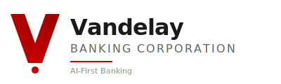
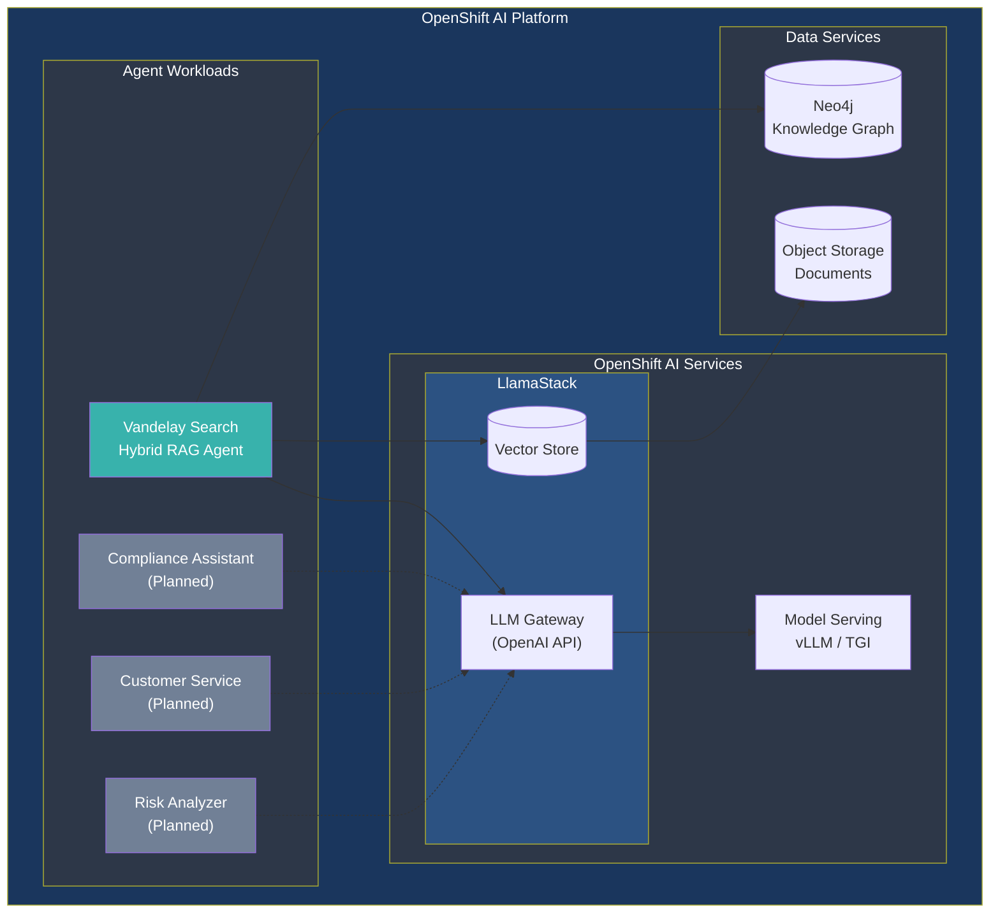
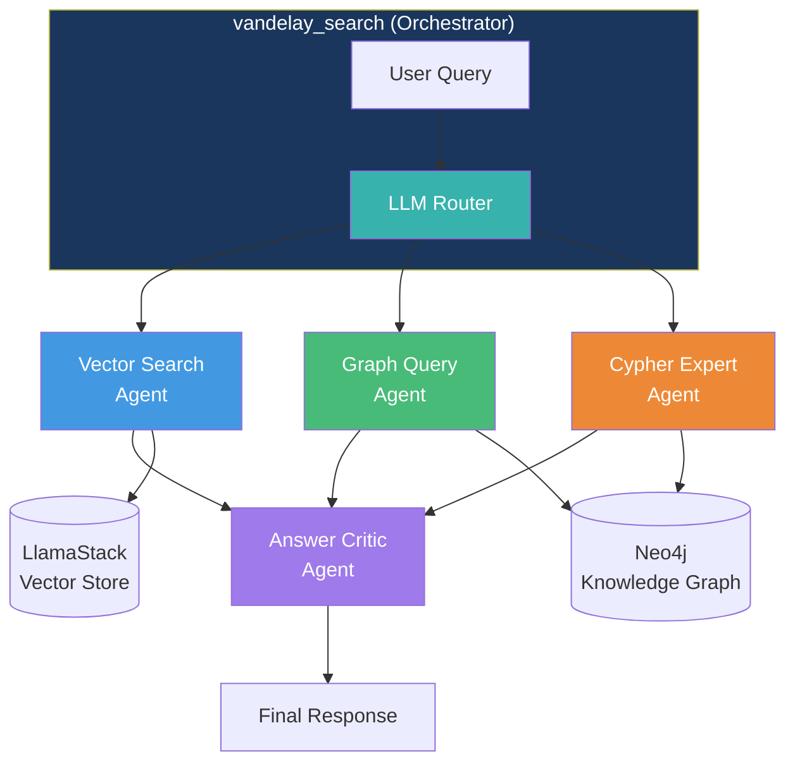

<p align="center">
  
</p>

<p align="center">
  <strong>Enterprise AI Agent Platform</strong><br/>
  <em>Pioneering the future of intelligent banking through autonomous AI agents</em>
</p>

<p align="center">
  
  
  
  
</p>

---

## About Vandelay Banking Corporation

Vandelay Banking Corporation is a forward-thinking financial institution that has embraced an **AI-First strategy** to transform how banking services are delivered. We believe that intelligent, autonomous AI agents—working alongside our human experts—can provide faster, more accurate, and more personalized service to our customers.

This repository contains our **Enterprise AI Agent Platform**, powered by **Red Hat OpenShift AI**. Agents are developed using [Google's Agent Development Kit (ADK)](https://github.com/google/adk-python) and deployed as containerized workloads on OpenShift, with LLM inference provided by LlamaStack.

## Platform Architecture



### Platform Components

| Layer | Component | Purpose |
|-------|-----------|---------|
| **Agent Workloads** | Containerized agents | Business logic, orchestration, tools |
| **OpenShift AI** | LlamaStack | Vector store & LLM gateway (OpenAI-compatible) |
| **OpenShift AI** | Model Serving | LLM inference (vLLM, TGI, OpenVINO) |
| **Data Services** | Neo4j | Knowledge graph for structured relationships |
| **Data Services** | Object Storage | Document storage for vector embeddings |

### Agent Characteristics

Each agent in the catalog is:
- **Self-contained**: Has its own configuration, tools, and sub-agents
- **Containerized**: Runs as an OpenShift workload with horizontal scaling
- **Observable**: Integrated with OpenShift monitoring and logging
- **Secure**: OpenShift RBAC, network policies, and secrets management

---

## Agent Catalog

Our AI-First strategy is powered by a growing catalog of specialized agents. Each agent is purpose-built for specific banking functions and can operate independently or collaborate with other agents.

### Production Agents

| Agent | Description | Architecture | Docs |
|-------|-------------|--------------|------|
| **[Vandelay Search](#vandelay-search-agent)** | Hybrid RAG agent combining semantic search with knowledge graph queries for intelligent information retrieval | Multi-agent orchestrator | [README](vandelay_search/README.md) |

### Planned Agents

| Agent | Description | Target |
|-------|-------------|--------|
| **Compliance Assistant** | AML/KYC verification, regulatory compliance checking, and audit trail generation | Q2 2026 |
| **Customer Service** | Natural language customer support, inquiry handling, and account assistance | Q3 2026 |
| **Risk Analyzer** | Real-time portfolio risk assessment, exposure analysis, and alert generation | Q3 2026 |
| **Transaction Monitor** | Fraud detection, suspicious activity monitoring, and transaction pattern analysis | Q4 2026 |
| **Document Processor** | Automated document classification, data extraction, and validation | Q4 2026 |

---

## Vandelay Search Agent

The flagship agent in our platform, **Vandelay Search** demonstrates the power of combining multiple retrieval strategies in a single intelligent assistant. It uses a **multi-agent orchestrator pattern** where specialized sub-agents handle different types of queries.

### Agent Architecture (Vandelay Search)



### Capabilities

- **Semantic Search**: Find relevant information from banking policies, product guides, and FAQs using natural language
- **Knowledge Graph Queries**: Retrieve structured data about customers, accounts, transactions, and relationships
- **Hybrid Retrieval**: Automatically combines both approaches for comprehensive answers
- **Answer Validation**: Built-in quality checking ensures accurate, complete responses

### Demo Scenarios

The platform includes sample data showcasing real banking use cases:

| Scenario | Vector Search | Graph RAG |
|----------|:-------------:|:---------:|
| "What is Basel III?" |  Policy documents | |
| "List all high-risk customers" | |  Customer nodes |
| "Explain AML procedures and show flagged accounts" |  Compliance docs |  Account data |
| "What mortgage products are available?" |  Product guides |  Product nodes |

---

## Quick Start

### Prerequisites

- [Podman Desktop](https://podman-desktop.io/) or Docker
- Python 3.11+
- Access to an LLM endpoint (OpenAI-compatible)
- Access to a LlamaStack vector store endpoint

### 1. Clone and Configure

```bash
git clone https://github.com/vandelay-corp/vandelay-ai.git
cd vandelay-ai

# Copy the template and add your credentials
cp openshift/local-stack.template.yaml openshift/local-stack.yaml

# Edit local-stack.yaml with your:
# - LLM endpoint (OPENAI_API_BASE)
# - API key (OPENAI_API_KEY)  
# - LlamaStack URL (LLAMASTACK_BASE_URL)
# - Vector store ID (VECTOR_STORE_ID)
```

### 2. Build the Agent Image

```bash
podman build -t vandelay-search:latest -f vandelay_search/Dockerfile vandelay_search/
```

### 3. Start the Platform

```bash
# Start Neo4j + Agent in a single pod
podman kube play openshift/local-stack.yaml
```

### 4. Load Sample Data

```bash
# Load knowledge graph data
NEO4J_URI="bolt://localhost:7687" \
NEO4J_USERNAME="neo4j" \
NEO4J_PASSWORD="your-password" \
python -m data_ingestion.ingest_graph --clear

# Load vector store data  
LLAMASTACK_BASE_URL="https://your-llamastack-endpoint" \
VECTOR_STORE_ID="your-vector-store-id" \
python -m data_ingestion.ingest_vector --clear
```

### 5. Access the Platform

| Service | URL |
|---------|-----|
| **ADK Web UI** | http://localhost:8000 |
| **Neo4j Browser** | http://localhost:7474 |

Select `vandelay_search` from the agent dropdown and start chatting!

---

## Project Structure

```
vandelay-ai/
├── vandelay_search/          # Vandelay Search Agent
│   ├── agent.py              # Main orchestrator agent
│   ├── config.yaml           # Agent configuration
│   ├── sub_agents/           # Specialized sub-agents
│   │   ├── vector_search/    # Semantic search agent
│   │   ├── graph_query/      # Knowledge graph agent
│   │   ├── cypher_expert/    # Raw Cypher query agent
│   │   └── answer_critic/    # Response validation agent
│   └── plugins/              # ADK plugins (logging, metrics)
│
├── data_ingestion/           # Data loading utilities
│   ├── ingest_graph.py       # Neo4j data loader
│   ├── ingest_vector.py      # Vector store loader
│   └── data/                 # Sample FSI data
│
├── openshift/                # Deployment manifests
│   ├── local-stack.template.yaml
│   ├── vandelay-search/      # Agent deployment
│   └── neo4j/                # Database deployment
│
├── .github/workflows/        # CI/CD pipelines
│   ├── graph-ingestion.yaml
│   └── vector-ingestion.yaml
│
└── assets/                   # Brand assets
    └── logo.svg
```

---

## Technology Stack

| Layer | Technology | Purpose |
|-------|------------|---------|
| **Platform** | [Red Hat OpenShift AI](https://www.redhat.com/en/technologies/cloud-computing/openshift/openshift-ai) | Enterprise AI/ML platform for production workloads |
| **LLM Serving** | LlamaStack (OpenShift AI) | LLM gateway & vector store (OpenAI-compatible API) |
| **Agent Development** | [Google ADK](https://github.com/google/adk-python) | Framework for building multi-agent systems |
| **LLM Routing** | LiteLLM | Unified interface across LLM providers |
| **Knowledge Graph** | Neo4j | Structured data and relationship queries |
| **Local Development** | Podman Desktop | Container runtime for local testing |

---

## Configuration

All configuration is centralized in `config.yaml` files with environment variable overrides:

| Environment Variable | Description |
|---------------------|-------------|
| `OPENAI_API_BASE` | LLM endpoint URL |
| `OPENAI_API_KEY` | LLM API key |
| `ADK_MODEL` | Model identifier (e.g., `openai/gpt-4`) |
| `NEO4J_URI` | Neo4j connection URI |
| `NEO4J_USERNAME` | Neo4j username |
| `NEO4J_PASSWORD` | Neo4j password |
| `LLAMASTACK_BASE_URL` | LlamaStack endpoint |
| `VECTOR_STORE_ID` | Vector store identifier |

---

## Development

Agents are developed locally using **Google ADK** and deployed to **OpenShift AI** as containerized workloads.

### Adding a New Agent to the Catalog

Each agent is a standalone Python package that can be containerized and deployed:

1. **Create the agent package**:
   ```bash
   mkdir -p new_agent/sub_agents
   touch new_agent/__init__.py new_agent/agent.py new_agent/config.yaml
   ```

2. **Define the agent** in `agent.py` using Google ADK:
   ```python
   from google.adk.agents import Agent
   from google.adk.models.lite_llm import LiteLlm
   
   my_agent = Agent(
       name="my_agent",
       model=LiteLlm(model="openai/your-model"),  # Via LlamaStack
       instruction="...",
       tools=[...],
   )
   ```

3. **Add tools** specific to your agent's domain

4. **Create a Dockerfile** for OpenShift deployment

5. **Add OpenShift manifests** under `openshift/<agent-name>/`

6. **Update the Agent Catalog** in this README

### Adding Sub-Agents (within an existing agent)

For adding specialized capabilities to an existing agent (like Vandelay Search):

1. Create a directory under `<agent>/sub_agents/`
2. Define the sub-agent following the existing patterns
3. Register it as a tool in the parent orchestrator

### Running Tests

```bash
# Install dev dependencies
pip install -e ".[dev]"

# Run tests
pytest
```

---

## Deployment

### Local Development (Podman Desktop)

For local development and testing before deploying to OpenShift AI:

```bash
# Start the local stack (Neo4j + Agent)
podman kube play openshift/local-stack.yaml

# View logs
podman logs -f vandelay-local-stack-vandelay-search

# Stop the stack
podman kube down openshift/local-stack.yaml
```

### Production (OpenShift AI)

Deploy agents as workloads on OpenShift AI, connecting to LlamaStack for LLM inference:

```bash
# Set environment variables
export OPENSHIFT_API="https://your-cluster-api:6443"
export OPENSHIFT_USER="your-username"
export OPENSHIFT_PASSWORD="your-password"

# Deploy Neo4j (if not using managed service)
./openshift/scripts/deploy-neo4j.sh

# Deploy agent workload
./openshift/scripts/deploy-app.sh
```

### OpenShift AI Prerequisites

| Service | Purpose | Endpoint |
|---------|---------|----------|
| LlamaStack | LLM Gateway + Vector Store | `LLAMASTACK_BASE_URL` |
| Model Serving | LLM Inference | Accessed via LlamaStack |
| Neo4j | Knowledge Graph | `NEO4J_URI` |

---

## Contributing

This is an internal Vandelay Banking Corporation project. For contribution guidelines, please contact the AI Platform team.

---

## License

Copyright © 2024-2026 Vandelay Banking Corporation. All rights reserved.

This software is proprietary and confidential. Unauthorized copying, distribution, or use is strictly prohibited.

---

<p align="center">
  <sub>Built with ❤️ by the Vandelay AI Platform Team</sub>
</p>
